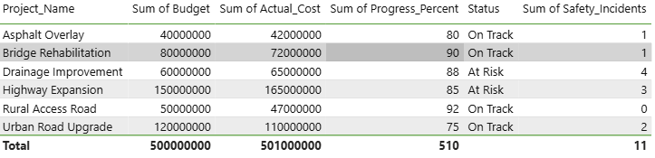

# Data Analytics Portfolio – kamil Bello

This repository contains data analytics projects demonstrating skills in operations, business, and performance analysis.

## Tools
- Microsoft Excel
- Power BI
- SQL
- Python (Pandas)

## Projects
## 📊 Project 1: Project Operations Performance Dashboard (Power BI)

### 🔍 Overview
This project analyzes project operations data to monitor budget usage, cost performance, progress status, and overall project health.  
The dashboard helps management quickly identify projects that are on track or at risk.

### 🧠 Business Questions Answered
- Which projects are over or under budget?
- What is the actual cost vs planned budget for each project?
- Which projects are at risk based on progress and cost variance?
- What is the overall project status distribution?

### 🛠 Tools Used
- Power BI (Data modeling & visualization)
- Microsoft Excel (Data source)

### 📈 Dashboard Highlights
#### Project Operations Overview

#### Budget vs Actual Cost

#### Project Progress and Cost Analysis

#### Project Status Summary Table

---

## Sales Performance Dashboard (Power BI)

### Overview
This project analyzes sales data to understand overall sales performance, product performance, and regional performance using Power BI.

### Business Problem
Management needs a simple way to see:
- Total sales performance
- Best-selling products
- Best-performing regions
- How sales change when filtering by product

### Data Source
- Sales data provided in Excel format

### Tools Used
- Microsoft Excel (data source)
- Power BI Desktop (data modeling and visualization)

### Dashboard Features
- KPI cards showing:
  - Total Sales
  - Total Quantity Sold
  - Average Unit Price
- Bar chart showing Total Sales by Product
- Bar chart showing Total Sales by Region
- Product slicer to filter the dashboard interactively
  
### Key Insights
-  Data Analyst focused on building dashboards and insights for business and operations teams.
- Laptop generated the highest total sales
- Lagos region recorded the highest sales
- Product filtering helps quickly compare performance
- Some projects exceeded their planned budgets, indicating cost overruns.
- Projects marked **At Risk** showed lower progress percentages compared to budget usage.
- Highway Expansion and Drainage Improvement projects require closer monitoring.
- The dashboard enables quick comparison of project performance and status.
- More projects coming: SQL analysis, customer insights, and trend analysis.

### Outcome
This dashboard helps decision-makers quickly understand sales performance and make informed business decisions.

## HR Salary Analysis Dashboard (Power BI)

This project analyzes employee salary distribution across departments using Power BI.

### Key Insights
- Total number of employees
- Average salary across departments
- Total salary cost by department
- Department-level comparison using interactive slicers

### Tools Used
- Power BI
- DAX (basic measures)
- Data modeling & visualization best practices

### Pages
1. Overview Dashboard
2. Department Analysis Dashboard
## Dashboard Preview

### Overview Page

### Department Analysis Page

